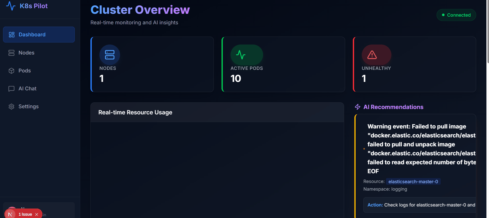
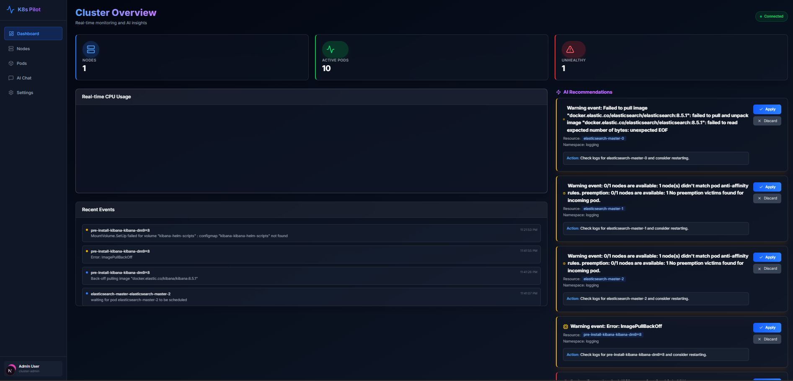
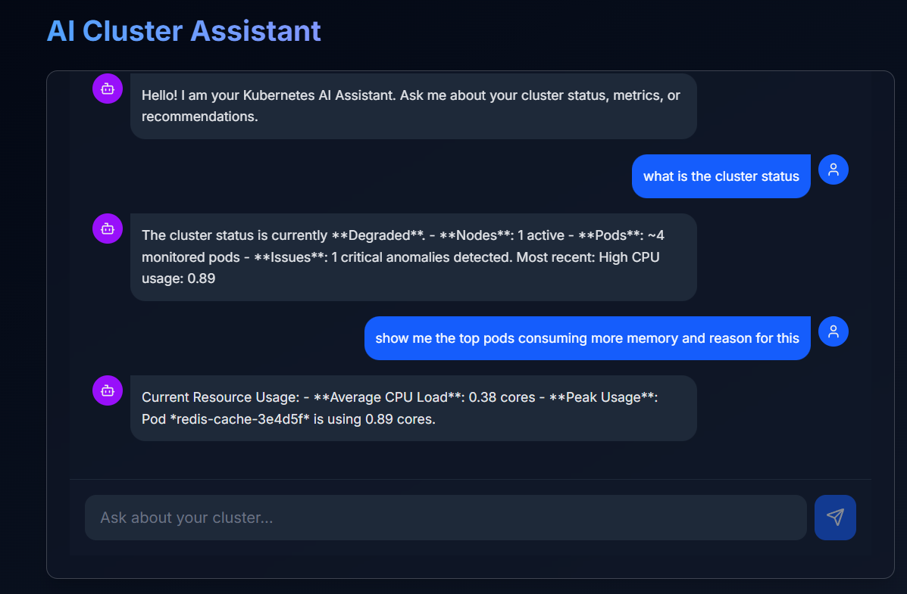

# K8s Pilot - AI-Powered Kubernetes Assistant


**K8s Pilot** is an intelligent, autonomous agent designed to simplify Kubernetes cluster management. By combining real-time monitoring with AI-driven insights, it detects anomalies, recommends optimizations, and provides a context-aware chat interface for natural language interaction with your infrastructure.



## 🌟 Why K8s Pilot?
Managing Kubernetes clusters can be complex. K8s Pilot acts as your virtual SRE (Site Reliability Engineer), constantly watching over your pods and nodes. It doesn't just show you graphs; it explains *what* is happening and *how* to fix it.

## ✨ Key Features

### 🖥️ Modern Glassmorphism Dashboard
A stunning, dark-themed UI built with **Next.js 14**, **Tailwind CSS**, and **Framer Motion**. It provides a high-level overview of your cluster's health at a glance.
- **Real-time CPU/Memory Charts** (powered by Recharts)
- **Live Event Stream** via WebSockets
- **Visual Status Indicators** for Nodes and Pods

<!-- Uncomment when you add screenshots:

-->

### 🤖 Context-Aware AI Chat
Stop running complex `kubectl` commands for simple checks. Just ask K8s Pilot:
- *"How is the cluster health?"*
- *"Are there any critical errors in the 'kube-system' namespace?"*
- *"Why is the frontend pod restarting?"*

The AI Agent analyzes live metrics, events, and logs to provide accurate, data-backed answers.

<!-- Uncomment when you add screenshots:

-->

### 🧠 Intelligent Recommendations
K8s Pilot detects inefficiencies and risks, such as:
- **High Resource Usage**: Suggests scaling up deployments.
- **Frequent Restarts**: Identifies crashing pods.
- **Configuration Issues**: Highlights missing limits or probes.

You can **Apply** or **Discard** these recommendations directly from the UI with a single click.

<!-- Uncomment when you add screenshots:

-->

### 🔬 Detailed Resource Inspector
Deep dive into specific resources with dedicated views for:
- **Nodes**: Inspect capacity, roles, and status.
- **Pods**: View restarts, age, and detailed health metrics.

<!-- Uncomment when you add screenshots:

-->

---

## 🏗️ System Architecture

### Frontend
- **Framework**: Next.js 14 (App Router)
- **Styling**: Tailwind CSS + CSS Modules
- **State Management**: React Hooks + WebSockets
- **Visuals**: Framer Motion for animations, Lucide React for icons

### Backend
- **API Framework**: FastAPI (Python 3.10+)
- **Cluster Interaction**: Official Kubernetes Python Client
- **Metrics**: Prometheus API Client (with fallback mock data for demos)
- **Real-time Engine**: Python `websockets` for live status push

---

## 🚀 Getting Started

### Prerequisites
- **Node.js** (v18+)
- **Python** (v3.10+)
- **Kubernetes Cluster** (Docker Desktop, Minikube, or any cloud provider)
- **Prometheus** (Optional - system falls back to mock data if unavailable)

### Installation

#### 1. Clone the Repository
```bash
git clone https://github.com/yourusername/k8s-pilot.git
cd k8s-pilot
```

#### 2. Backend Setup
```bash
cd backend
python -m venv venv
# Windows:
venv\Scripts\activate
# Mac/Linux:
source venv/bin/activate

pip install -r ../requirements.txt

# Start the API Server
uvicorn app.main:app --reload --port 8000
```

#### 3. Frontend Setup
```bash
cd frontend
npm install

# Start the Dashboard
npm run dev
```

Visit **http://localhost:3000** to access the dashboard.

---

## 🤝 Contributing
Contributions are welcome! Please fork the repository and create a Pull Request for any features or bug fixes.

## 📄 License
This project is licensed under the MIT License - see the [LICENSE](LICENSE) file for details.
